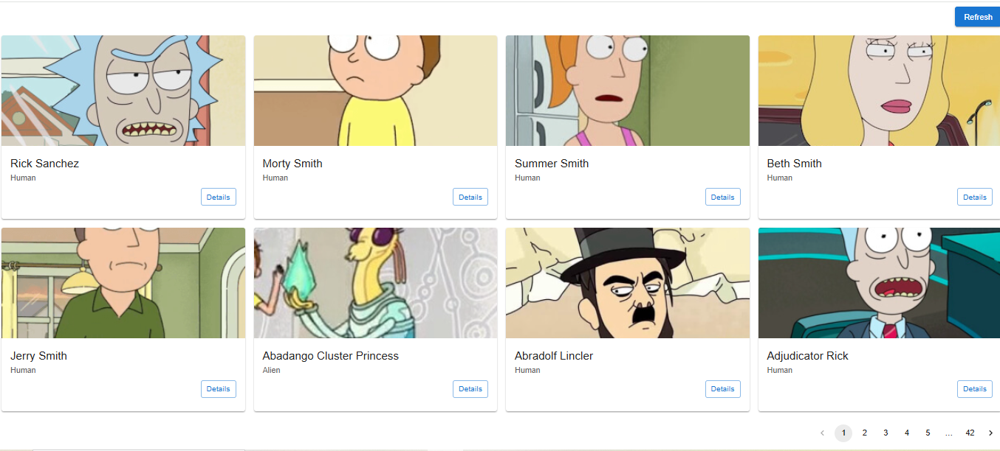
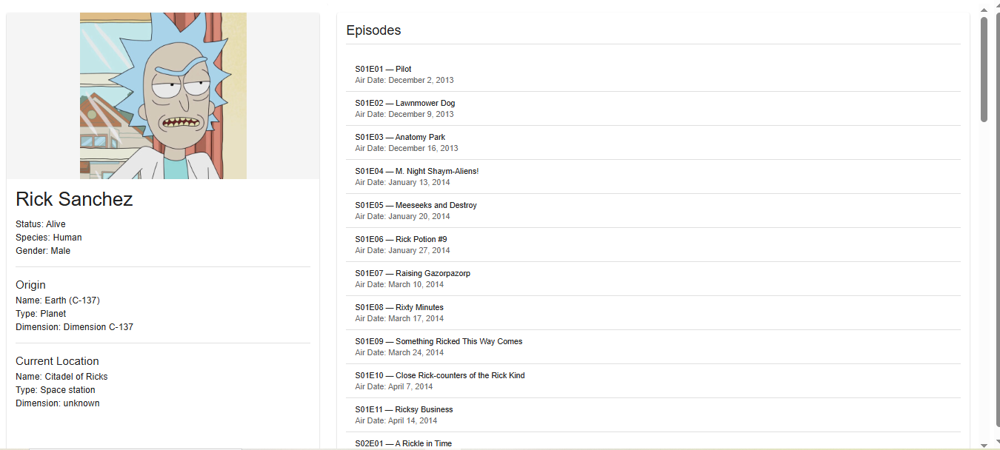

# Rick and Morty Explorer

A React app built with **Material UI** and **React Query** to explore characters, locations, and episodes from the [Rick and Morty API](https://rickandmortyapi.com/).

---

## Features
- Browse and search Rick and Morty characters
- Detailed character view including:
  - Status, species, gender
  - Origin and current location
  - Episodes they appear in
- Responsive layout with Material UI cards
- Fast data fetching & caching powered by React Query

---

## Tech Stack
- [React (Create React App)](https://create-react-app.dev/)
- [TypeScript](https://www.typescriptlang.org/)
- [Material UI (MUI)](https://mui.com/)
- [React Query](https://tanstack.com/query/latest)
- [Rick and Morty API](https://rickandmortyapi.com/)

---

##  Installation & Setup

1. **Clone the repository**
   ```bash
   git clone https://github.com/your-username/rick-morty-app.git
   cd rick-morty-app

2. **Install dependencies**
   npm install

3. **Start the development server**
   npm start

4. **Open in your browser at:**
   http://localhost:3000/risk_morty_explorer/#/character

**Screenshots**   



  
